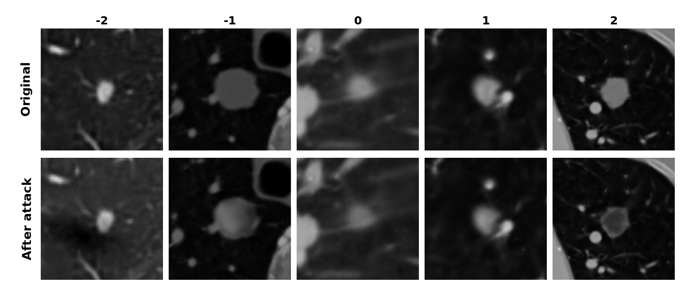

# COGENT: Counterfactual Gaussian Explanations for Volumetric Medical Images

Counterfactual PGD attack on MedGS / 3DGS Gaussian parameters using gradients from the Sybil lung-cancer risk classifier.

## Clone

MedGS is included as a git submodule, so clone recursively:

```bash
git clone --recurse-submodules https://github.com/gmum/COGENT.git
```

## Prerequisites

- Linux + NVIDIA GPU
- Conda installed
- This repository cloned with submodules available

## Setup

Run from repository root:

```bash
bash setup.sh
```

This script:

- updates MedGS submodules,
- creates/updates the `sybil_interpretability` conda env,
- installs PyTorch + CUDA packages,
- builds MedGS CUDA extensions (`diff-gaussian-rasterization`, `fused-ssim`, `simple-knn`).

## Sybil checkpoints

Sybil weights are **not** bundled with this repository. They are public (MIT license)
and published as a GitHub release asset:

```bash
mkdir -p data/weights/sybil/checkpoints
curl -L -o /tmp/sybil_checkpoints.zip \
  https://github.com/reginabarzilaygroup/Sybil/releases/download/v1.5.0/sybil_checkpoints.zip
unzip /tmp/sybil_checkpoints.zip -d /tmp/sybil_ckpt
```

The archive ships the five ensemble members named by md5 hash (`*.ckpt`) plus the
calibrators. Map them to the names this repo expects:

| file in release                          | file here     |
|------------------------------------------|---------------|
| `28a7cd44f5bcd3e6cc760b65c7e0d54d.ckpt`  | `sybil_0.pt`  |
| `56ce1a7d241dc342982f5466c4a9d7ef.ckpt`  | `sybil_1.pt`  |
| `624407ef8e3a2a009f9fa51f9846fe9a.ckpt`  | `sybil_2.pt`  |
| `64a91b25f84141d32852e75a3aec7305.ckpt`  | `sybil_3.pt`  |
| `65fd1f04cb4c5847d86a9ed8ba31ac1a.ckpt`  | `sybil_4.pt`  |

`sybil_ensemble_simple_calibrator.json` is already named correctly — copy it as is.

Final layout:

```text
data/weights/sybil/checkpoints/
├── sybil_0.pt
├── sybil_1.pt
├── sybil_2.pt
├── sybil_3.pt
├── sybil_4.pt
└── sybil_ensemble_simple_calibrator.json
```

Mirrors: the same files are on the Google Drive folder linked in the
[Sybil README](https://github.com/reginabarzilaygroup/Sybil), and the `sybil`
package will fetch them into `~/.sybil` automatically via `Sybil("sybil_ensemble")`.

Weights and code from Mikhael et al., *Sybil: A Validated Deep Learning Model to
Predict Future Lung Cancer Risk From a Single Low-Dose Chest CT*, JCO 2023.


## Run Experiment

### 1. Activate env and set runtime paths

```bash
conda activate sybil_interpretability
export MEDGS_ROOT="$PWD/submodules/MedGS"
export PYTHONPATH="$PWD/submodules/Sybil/src:$PWD/submodules/Sybil/src_sybil:$PWD/submodules/MedGS:$PYTHONPATH"
```

### 2. Run attack

Example command used in this workspace:

```bash
python main.py \
  --model_path data/1/1 \
  --source_path data/1 \
  --masks data/1/masks \
  --output_ply data/1/1/attacked_clf.ply \
  --sigma 0.5 --remove_top_pct 10.0 \
  --props f_dc_0 f_dc_1 f_dc_2 \
  --eps 0.5 --steps 10 \
  --attack_mode untargeted \
  --classifier_config_dir "$PWD/submodules/Sybil/configs" \
  --classifier_config_name nlst_sybil_ensemble_inference \
  --target_year 5 \
  --max_slices 60
```

The attacked Gaussian point cloud is written to:

```text
data/1/1/attacked_clf.ply
```

## Analysis

The analysis compares attacked renders vs clean renders and extracts
connected components inside lungs.

### 1. Render attacked PLY (without overwriting clean model folder)

```bash
cp -r data/1/1 data/1/1_attacked_clf
cp data/1/1/attacked_clf.ply data/1/1_attacked_clf/point_cloud/iteration_30000/point_cloud.ply

python submodules/MedGS/render.py \
  --model_path data/1/1_attacked_clf \
  --source_path data/1 \
  --iteration 30000 \
  --camera mirror \
  --pipeline img
```

Clean renders are read from `data/1/1/render_img` and attacked renders from
`data/1/1_attacked_clf/render_img`.

### 2. Generate per-pixel diff images

```bash
python -c "from analysis.image_diff import generate_image_diffs as f; f('data/1/1_attacked_clf/render_img','data/1/1/render_img','analysis/run1/diffs')"
```

### 3. Connected-components analysis inside lung masks

```bash
python -c "from analysis.component_analysis import analyze_connected_components as f; f(diff_folder='analysis/run1/diffs', output_folder='analysis/run1/components', lung_masks_folder='data/1/lung_masks', threshold=None, min_area=20, closing_radius=5)"
```

Outputs:

- `analysis/run1/components/centroids.csv`
- `analysis/run1/components/masks/`
- `analysis/run1/components/visualizations/`

### 4. Overlay centroid circles on originals

```bash
python -c "from analysis.overlay_circles import draw_circles_on_originals as f; f(csv_path='analysis/run1/components/centroids.csv', originals_folder='data/1/original', output_folder='analysis/run1/annotated', radius_mode='area', scale=1.5, min_radius=10, thickness=2, color=(255,0,0))"
```
### 5. Running the full pipeline

alternatively the full pipeline can by run via
```bash
  $ bash run_patient_pipeline.sh <patient_id>
```
## Structure

```
.
├── attack/                       attack pipeline
│   ├── main.py                   entry point
│   ├── cli.py                    command-line arguments
│   ├── constants.py              Sybil / MedGS constants
│   ├── medgs_bootstrap.py        finds MedGS on sys.path
│   ├── ply_io.py                 raw PLY reading + SH-degree detection
│   ├── geometry.py               camera matrices, 3D covariances, projection
│   ├── camera_loader.py          matches cameras.json with mask files
│   ├── mask_filtering.py         selects Gaussians lying inside masks
│   ├── attribute_mapping.py      PLY fields <-> GaussianModel tensor slices
│   ├── classifier_loader.py      Sybil ensemble (frozen weights)
│   ├── volume_rendering.py       renders slices into a Sybil-shaped volume
│   ├── pgd_attack.py             PGD loop on Gaussian attributes
│   └── scene_setup.py            MedGS Scene initialization
│
└── analysis/                     post-attack analysis
    ├── image_diff.py             per-pixel absolute diffs between two folders
    ├── component_analysis.py     connected components inside the lung masks
    └── overlay_circles.py        draws circles on originals from centroid CSV
```

## End-to-end pipeline

1. Train MedGS on a CT volume.
2. Run `python main.py ...` to generate an attacked PLY.
3. Render attacked slices with `submodules/MedGS/render.py`.
4. Run `analysis/image_diff.py` to create attacked-vs-clean diffs.
5. Run `analysis/component_analysis.py` to keep components inside lungs.
6. Run `analysis/overlay_circles.py` to annotate originals.

<p align="center">
  <br>
  <em>Figure 1. 3D representation of lungs with a tumor.</em>
</p>

<p align="center">
  <br>
  <em>Figure 2. Comparison of nodules before and after the attack, including physician annotations (a plus sign indicates positive changes regarding prognosis, a minus sign indicates negative changes, and the number indicates severity).</em>
</p>

